# 春节倡议：祝你过年不用饿了么

这几天看惯了各大品牌铺天盖地的春节营销广告，满屏都是红色喜悦的视觉冲击，但是，有一个品牌给大家带来了一些不一样的东西：一份来自饿了么的春节倡议《祝你过年不用饿了么》没有复杂的背景元素，没有商品，没有明星爱豆，只有几段纯文字排版。

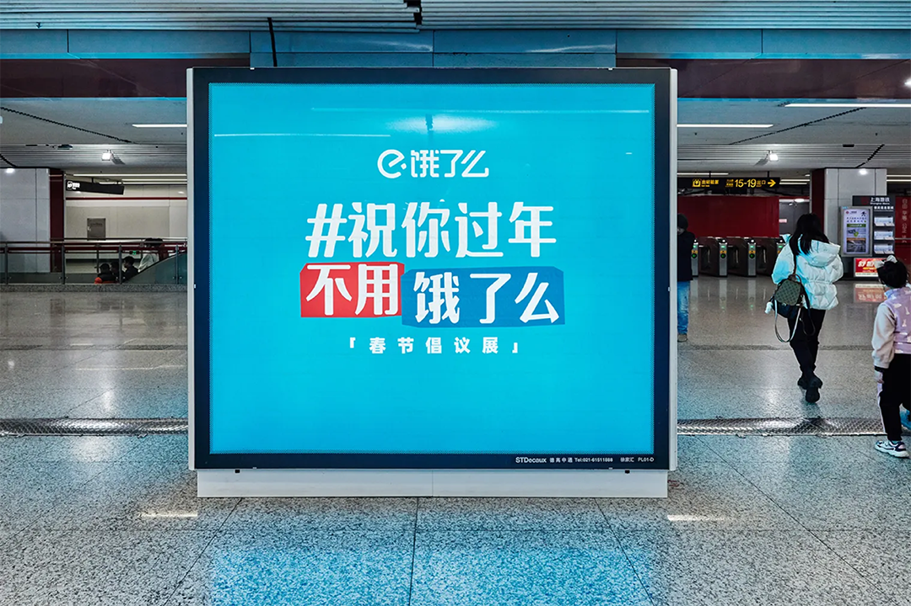
<!-- more -->
这份设计虽然简单，效果却非常出圈，清奇的角度，看似背刺品牌，实则站在用户的角度，鼓励用户回归最平凡的幸福。这是一个非常优秀的反向输出案例，建议童鞋们在没有头绪的时候，翻翻看，怎么从相反角度寻找灵感。

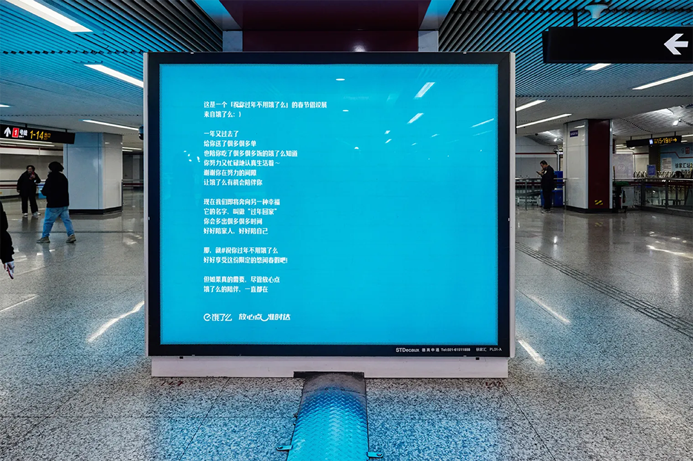

《这回饿了，是真可以喊妈！》

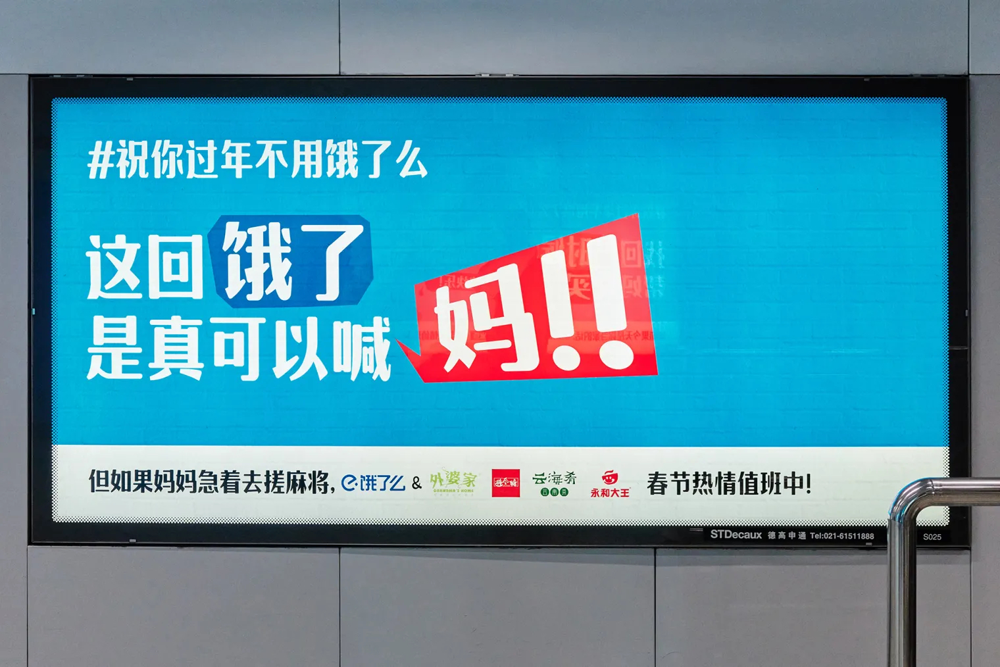

《和妈妈早起去花市挑束年宵花》

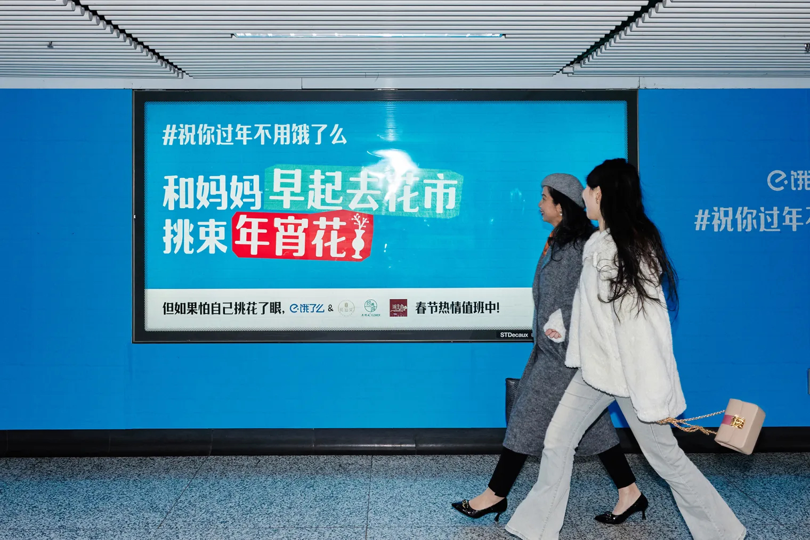

《找回小时候帮妈妈买瓶酱油的快乐！》

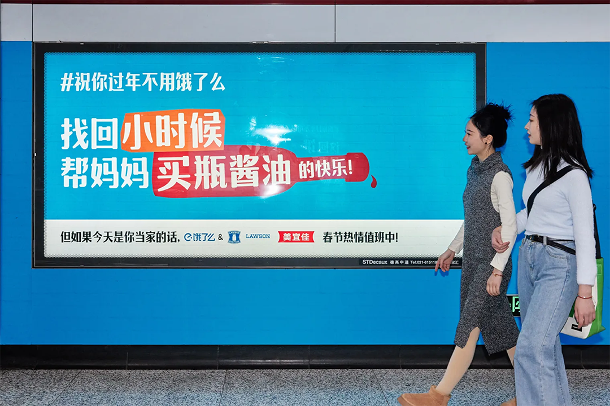

《外婆家的老母鸡已经等你整一年了！》

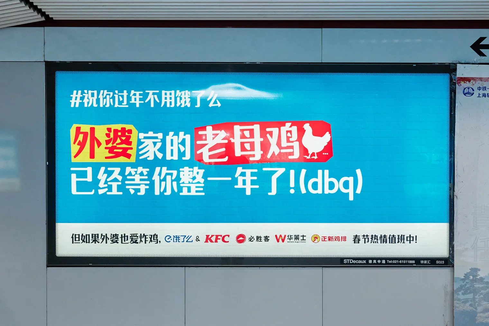

《又可以去超市手插大米了，嘿嘿嘿！》

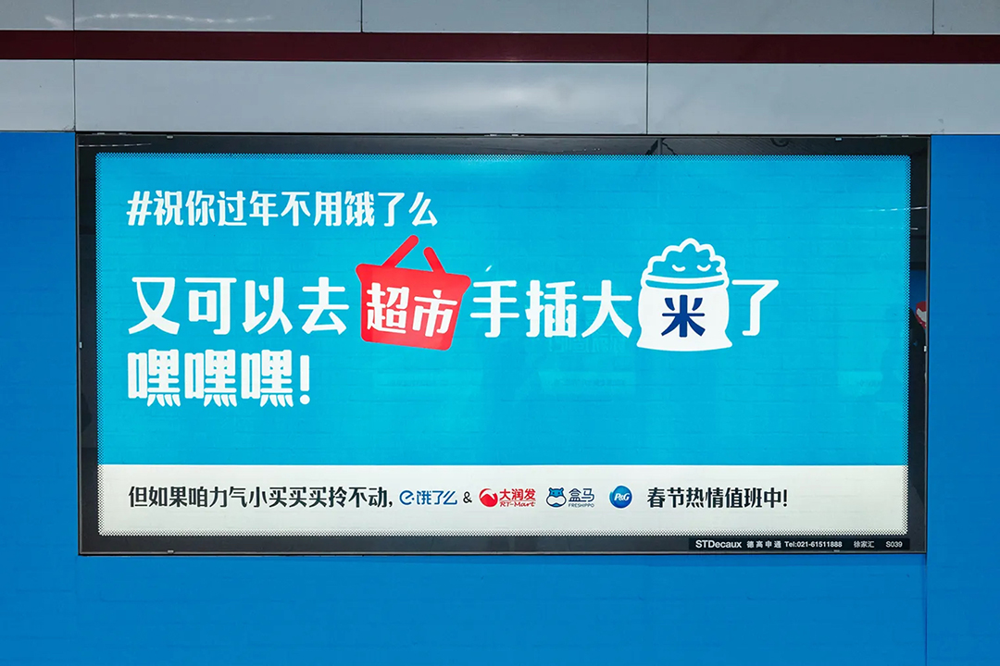

《可乐薯片和辣条，弟弟跑腿买的就是更好吃》

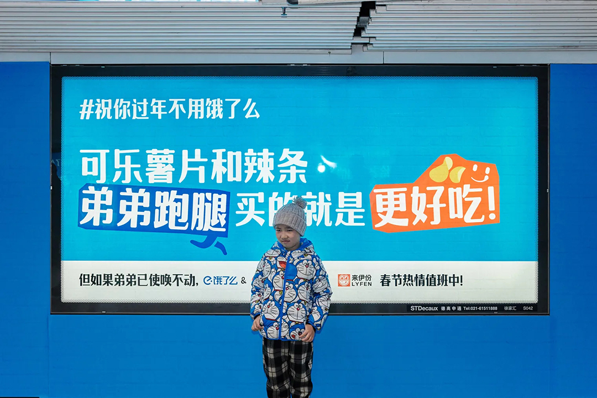

《去菜场唠唠嗑砍砍价，说说好久不说的家乡话》

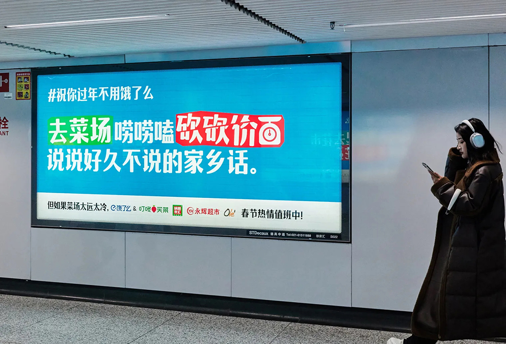

《老舅家的杀猪菜，你就造吧！》

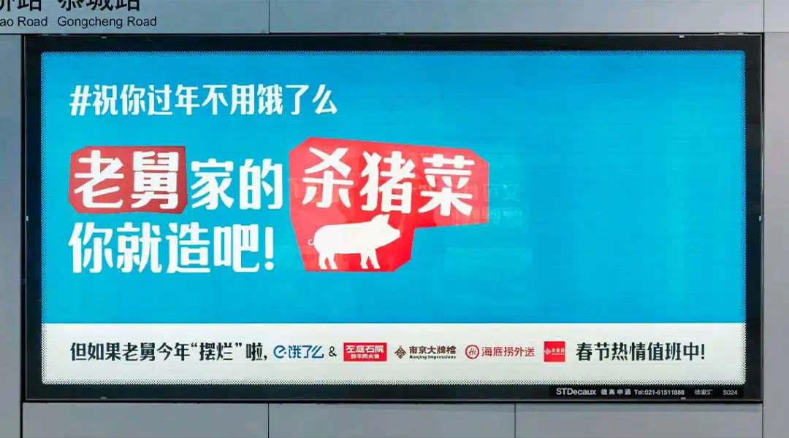

《要用就只用爷奶给的红包》

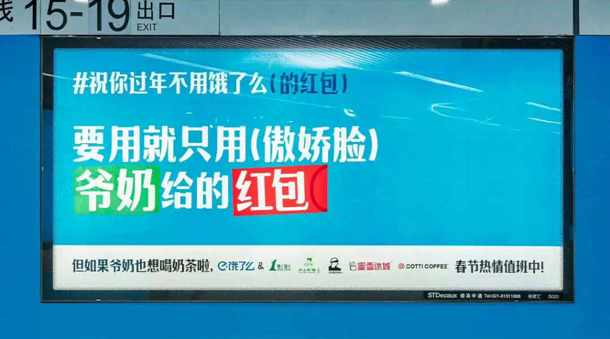

《给老爸钓的鱼一个解冻的机会》

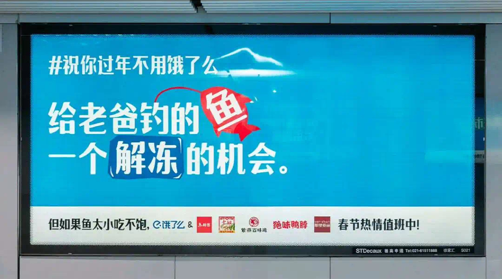

《如果有时间，你可以手把手教教不会的爷奶爸妈怎么用》

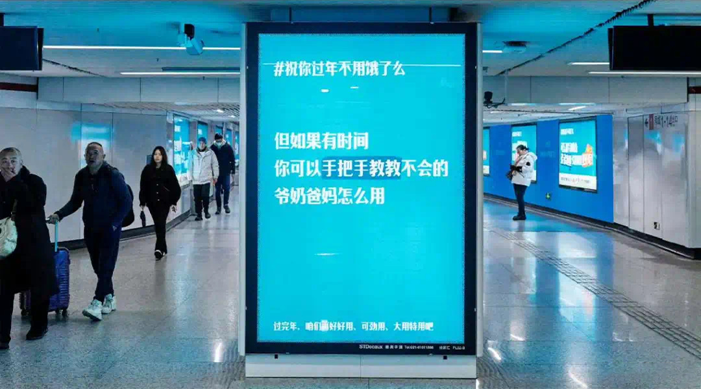

看完了饿了么的设计，我第一个想法就是，我上我也行！但其实这是很难的，设计师需要面对当下时代的命题和情绪，不是炫技和ROI，而是冷静与合适。假如策划端早已敲定围绕情绪价值进行设计，设计师从设计的第一性原理出发，以最低的理解成本，去达成与用户进行情绪上的有效沟通，那么纯文字排版+纯色背景+拟物色块，就是非常合适的设计。

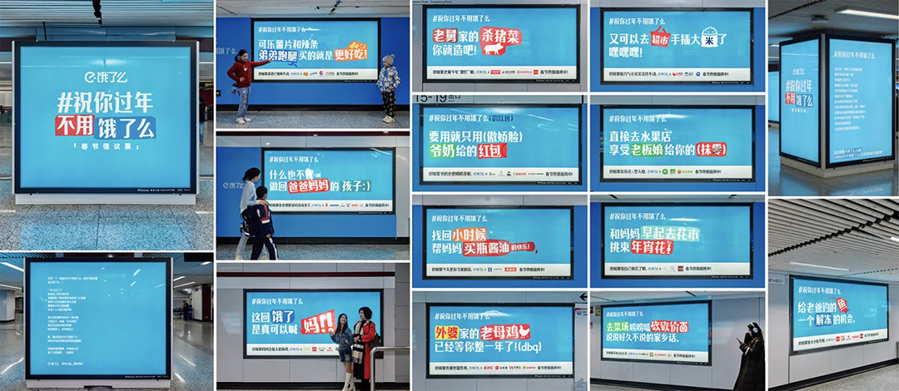

如果饿了么这次春节营销选择了常规的人货场、红色视觉方案，那么大概率会淹没在大家匆忙的脚步声中。一念成佛，一念成歌。在这个反内耗的对话时代，饿了么想开了，跟网友们来了个双向奔赴。选择和大家站在一起，真心地祝大家过年不用饿了么。祝大家能放下手机，见我们想见的人，去菜市场，去超市，和家人一起好好享受这份暂停，这份自我松绑。

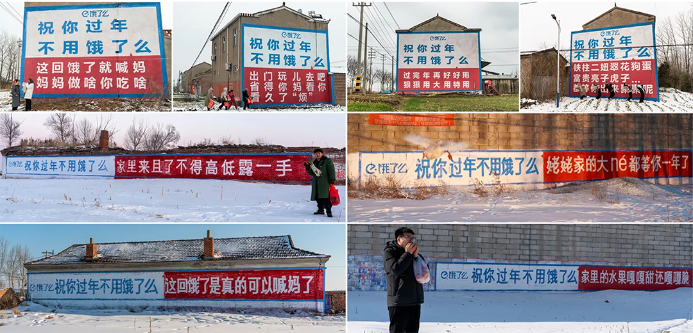

当然，除了好评和支持，也有反对和鄙视的声音。管他呢，这个方案能引起讨论就已经是一份意外收获了。况且，这只是饿了么春节营销的一环呢，你没看到每张海报下方都有合作伙伴正常营业的温馨提示吗？

作为常年在家的我，今年也给我妈带来了一波反向输出，临近年关不做家务，不参与家庭年末大扫除，于是，我收获了这张珍贵的偷拍照，这是我爸第二次跟我妈一起贴春联，而第一次，是他们结婚那年。

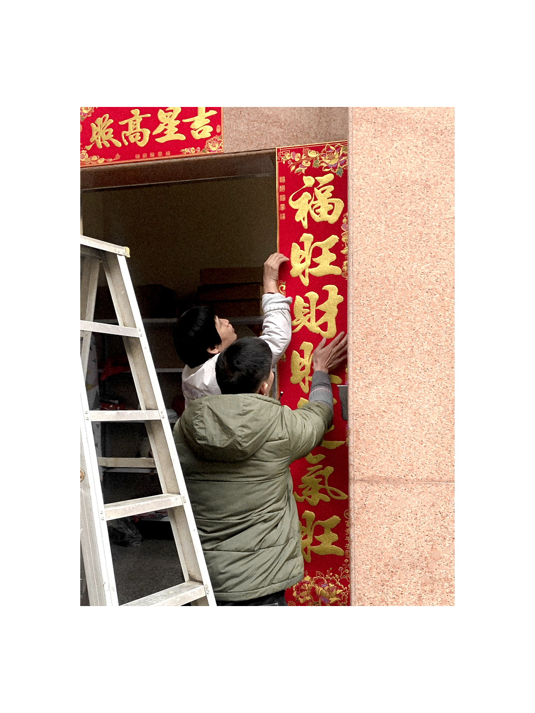